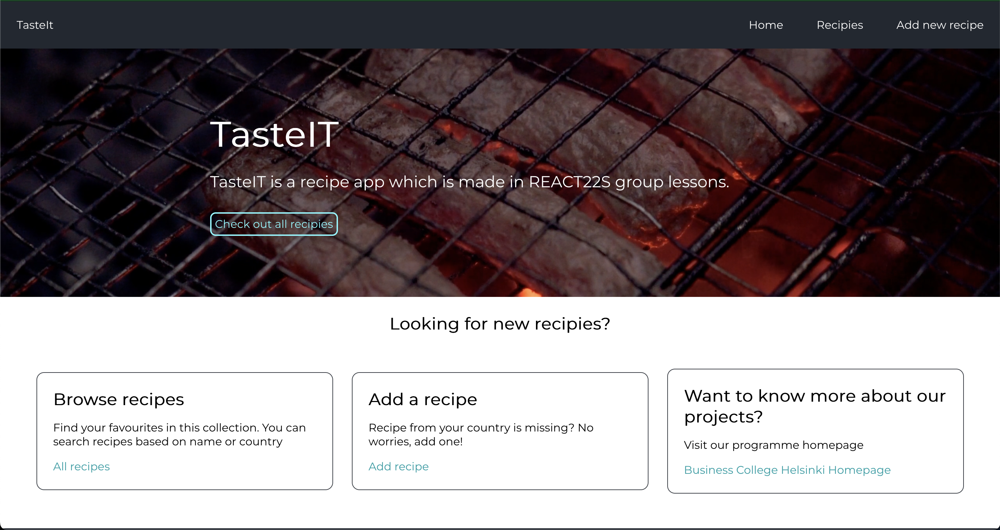
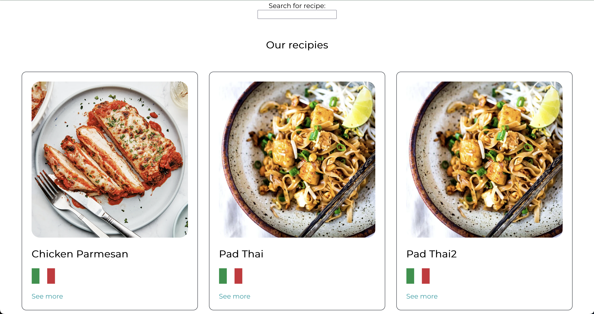
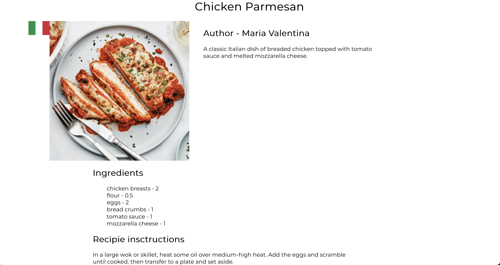

[](https://sonarcloud.io/summary/new_code?id=IlyaPonomarenko_REACT22S_RecipeApp)
[](https://sonarcloud.io/summary/new_code?id=IlyaPonomarenko_REACT22S_RecipeApp)
[](https://sonarcloud.io/summary/new_code?id=IlyaPonomarenko_REACT22S_RecipeApp)
# TasteIt app 

This project was created as a part of REACT22s programme at Business College of Helsinki.

## What is it about?

This app is a collection of recipies from all over the world. You can add your favorite recipe too!

## How to run

1. Fork this repository and clone it to your device
2. Install dependencies using a terminal command ```npm install```
3. Run the server containing the database using a terminal command ```npx json-server --watch db.json```
4. Run the app itself using a terminal command ```npm start```

## Preview of the app

- Home page

- All recipies

- Single recipie

- Add new recipie


